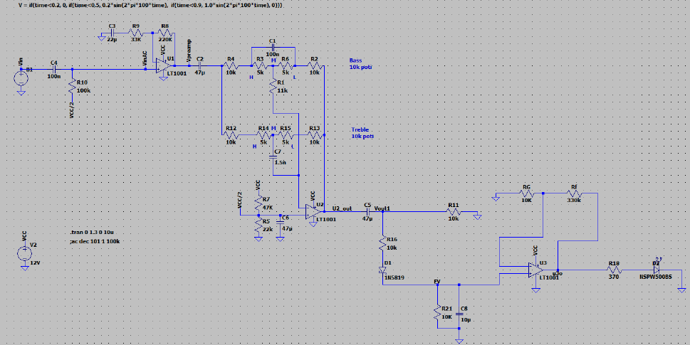
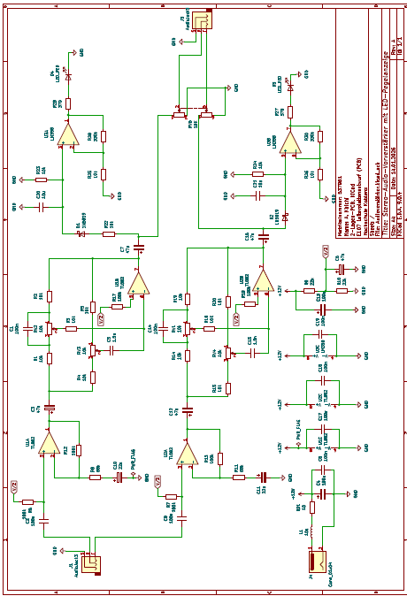
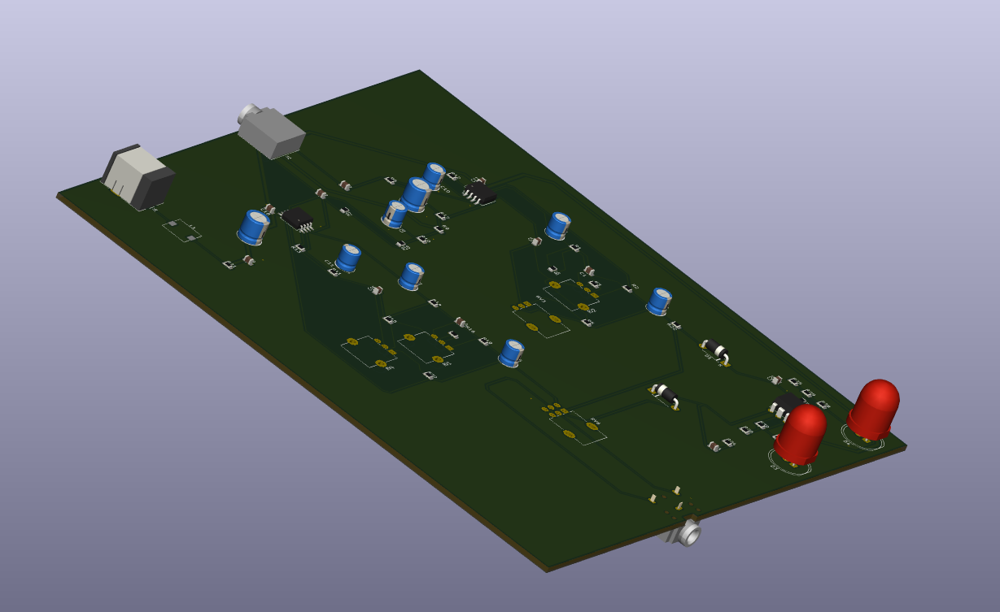

# Stereo Audio Pre-Amplifier with LED Level Indicator (KiCad)

## Overview

This project presents the design and implementation of a stereo analog audio pre-amplifier with an integrated LED level indicator.
The system amplifies low-level audio signals and provides a visual indication of signal activity.

---

## LTspice Simulation Model

Analog simulation model used to design and validate the circuit behavior.
Includes amplifier stages, tone control network (bass and treble), and LED signal detection.

---

## KiCad Circuit Schematic

Final circuit implementation translated into KiCad, including all components required for physical realization.

---

## Simulation Results

Frequency response obtained from LTspice simulation, showing stable gain across the audio range and controlled filtering behavior.

---

## PCB Design (3D View)

3D visualization of the PCB layout designed in KiCad, showing component placement, routing, and overall board structure.

---

## Features

* Stereo audio amplification
* Active bass and treble control
* LED-based signal level indication
* Single supply operation (12V)
* Full PCB design and layout
* Simulation-based validation

---

## Bill of Materials

Main components used:

* Operational amplifiers: TL082, LM358
* Capacitors: 100nF, 47µF, 100µF, 1.5nF
* Resistors: 10kΩ, 100kΩ, 330kΩ and others
* Diodes: 1N5819
* LEDs: red indicator LEDs
* Audio connectors: 3.5mm jack

---

## Documentation

The complete project report and detailed design documentation are not publicly included.
For further information, please contact the author.

---

## Tools Used

* KiCad
* LTspice

---

## Author

Ayoub Khichi Elektrotechnik (B. Eng.) Hochschule Koblenz
